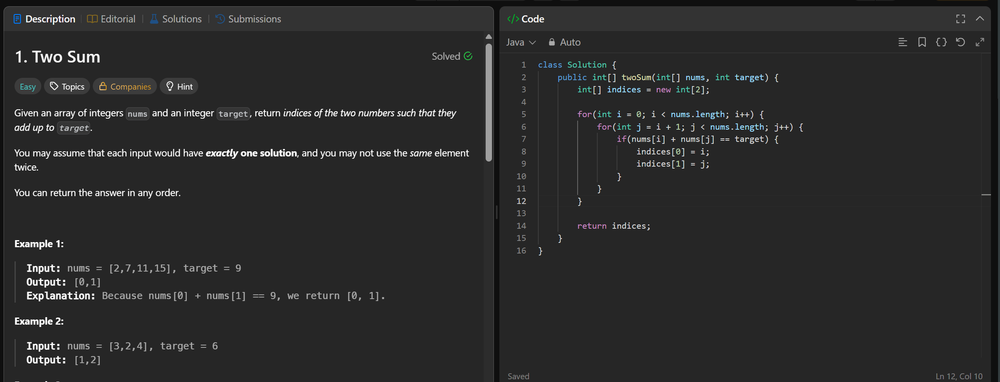

# Two Sum

[Problem Link](https://leetcode.com/problems/two-sum/)

## Goal
I'm tackling the Two Sum problem on LeetCode, which asks me to find two numbers in an array that add up to a given target. I find this problem interesting because it seems simple at first, but it actually requires some thought to solve efficiently, and I'm excited to dive into it.

## Approach
My initial thought was to use a brute force approach with nested loops to check every possible pair of numbers in the array. However, I quickly realized that this strategy, while straightforward, would be inefficient for large arrays. The key insight that clicked for me was that I didn't need to find all pairs, just the first pair that sums up to the target, but even that was not the most efficient way to solve this. I could have used a HashMap to store the numbers and their indices, which would allow me to find the solution in a single pass, but that's not what I initially did. I started with the brute force method, which, as I expected, worked but wasn't optimal.

## Code
```java
class Solution {
    public int[] twoSum(int[] nums, int target) {
        int[] indices = new int[2];

        for(int i = 0; i < nums.length; i++) {
            for(int j = i + 1; j < nums.length; j++) {
                if(nums[i] + nums[j] == target) {
                    indices[0] = i;
                    indices[1] = j;
                }
            }
        }

        return indices;
    }
}
```

## Complexities
- Time complexity: O(N^2)
- Space complexity: O(1)

## Screenshot

